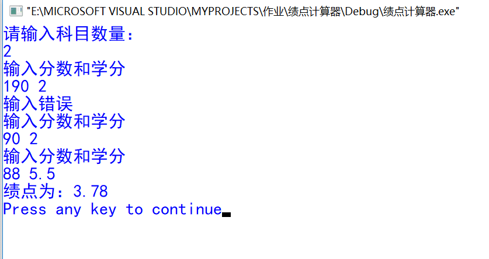
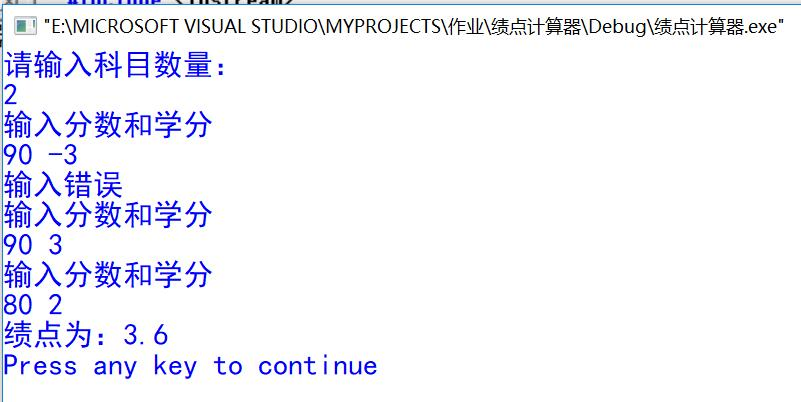
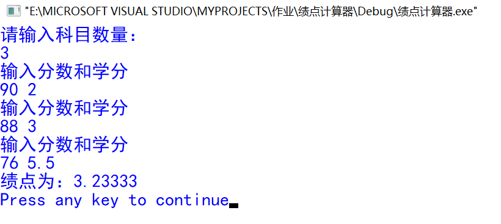

# 第一次作业（曹欣怡 U201711730）    
### **1.Project Title**<br>
这是一个绩点计算器，绩点满分为5，绩点计算过程复杂，可帮助有需要的同学省去复杂繁琐的计算过程。
### **2.Getting Started**<br>
该功能简单，依靠普通的代码读译程序即可，例如Virsal C++等。
### **3.Running the tests**<br>
分数超出正常区间<br>
<br>
学分小于0<br>
<br>
正常情况<br>

### **4.Code**<br>
```
#include <iostream>
using namespace std;
```
_//grade函数：分数转换_
```csharp
double grade(double n)
{
       if (n<60) return 0;
	   else if ((n>60||n==60)&&(n<61||n==61)) return 1.3;
	   else if ((n>62||n==62)&&(n<65||n==65)) return 1.7;
	   else if ((n>66||n==66)&&(n<70||n==70)) return 2.0;
	   else if ((n>71||n==71)&&(n<74||n==74)) return 2.3;
	   else if ((n>75||n==75)&&(n<77||n==77)) return 2.7;
	   else if ((n>78||n==78)&&(n<81||n==81)) return 3.0;
	   else if ((n>82||n==82)&&(n<84||n==84)) return 3.3;
	   else if ((n>85||n==85)&&(n<89||n==89)) return 3.7;
	   else if ((n>90||n==90)&&(n<100||n==100)) return 4.0;
} 
```           
_//count函数：计算加权分数_
```csharp
double count(double m,double n)
{
   return grade(n)*m;               //调用grade函数
}
```
_//主函数：计算绩点_
```csharp
int main()
{
  double number=0;
  double m,n,p=0;
  int x=0,i;
  cout<<"请输入科目数量："<<endl;
  cin>>x;
  i=0;
  do
  {
	  cout<<"输入分数和学分"<<endl;
      cin>>n>>m;                    //n是分数,m是学分
	  if (n<0||n>100||m<0||m==0)
		  cout<<"输入错误"<<endl;
      else 
	  {
		  p=p+count(m,n);                //调用函数count
          number=number+m;
	      i=i+1;
	  }
  }
  while (i<x);
  cout<<"绩点为："<<p/number<<endl;
  return 0;
}
```
### **5.Usage**<br>
由代码可以看出来，使用时只需输入总的科目数量、每科的分数以及学分即可。
### **6.Versioning**<br>
目前只能实现计算绩点这一简单的功能，往后希望能设计、实现更多的功能例如：班级平均分的计算与排名、分数段人数的统计，并将这些功能汇总在一个软件里。 
### **7.Author**<br>
曹欣怡
